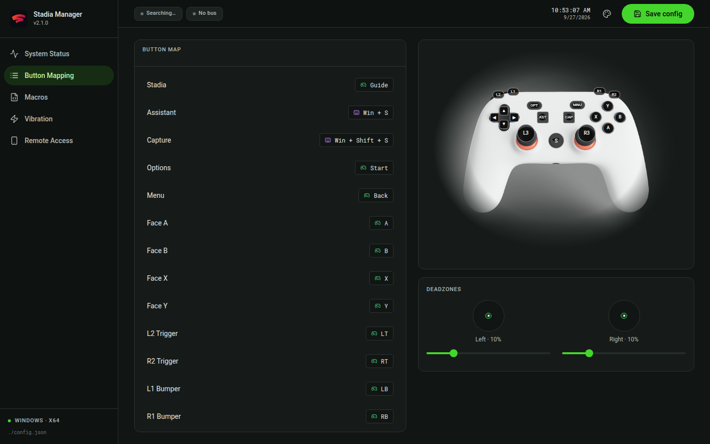

# Stadia Manager

[English](readme-en.md) · **فارسی** · [Русский](readme-ru.md)

> مدیریت‌کنندهٔ دستهٔ Google Stadia برای ویندوز — تبدیل به دستهٔ مجازی Xbox 360



## معرفی

**Stadia Manager** یک برنامهٔ دسکتاپ ویندوز (ساخته‌شده با Tauri v2) است که بعد از
تعطیلی Stadia هم دستهٔ گوگل استادیا را قابل استفاده نگه می‌دارد. برنامه دسته را از
طریق یک موتور کوچکِ C به‌صورت واقعی می‌خواند، امکان تغییر نقشهٔ همهٔ دکمه‌ها را
می‌دهد، و ورودی را از درایور ViGEmBus به‌صورت یک دستهٔ استاندارد **Xbox 360** به
بازی‌ها می‌فرستد؛ بنابراین هر بازی‌ای که دستهٔ Xbox پشتیبانی می‌کند بدون هیچ تنظیم
اضافه‌ای کار می‌کند.

این برنامه یک اپلیکیشن دسکتاپ واقعی است: پنجرهٔ مستقل با آیکون در system tray و
نصب‌کنندهٔ `.msi`/`.exe` — نه یک صفحهٔ وب داخل پوسته.

## امکانات

| بخش | کاری که انجام می‌دهد |
| --- | --- |
| **System Status** | نمایش زندهٔ وضعیت ViGEmBus، HidHide، هستهٔ درایور، سرویس موبایل، شارژ باتری، نوع اتصال (USB/Bluetooth) و تعداد دسته‌ها. نصب/حذف درایورها با یک کلیک. |
| **Button Mapping** | تغییر نقشهٔ هر ۱۹ ورودی روی عکس واقعی دسته، همراه با سه حالت اتصال برای هر دکمه. |
| **Macros** | ساخت ماکروهای چندمرحله‌ای (گام‌های `press` و `wait`) و اجرای آن‌ها با یک کلیک. |
| **Vibration** | تست لرزش و تنظیم قدرت کلی آن. |
| **Remote Access** | راه‌اندازی یک سرور HTTP کوچک (پورت پیش‌فرض `9090`) تا گوشی شما وضعیت را نشان دهد و لرزش را فعال کند. |
| **Themes** | پنج پوستهٔ رنگی (سبز، آبی، فیروزه‌ای، نارنجی، بنفش). |
| **Tray** | بستن پنجره آن را به tray می‌برد؛ خروج از منوی tray. |

## بخش Button Mapping


در این صفحه عکس واقعی دستهٔ شما نمایش داده می‌شود و روی هر دکمه یک برچسب (hotspot)
نشسته است — در مجموع ۱۹ برچسب: دکمه‌های صورت، جهت‌نما، ضربه‌گیرها (Bumper)، ماشه‌ها
(Trigger)، کلیک استیک‌ها، و دکمه‌های Stadia، Assistant، Capture، Options و Menu.
با حرکت دادن موس روی هر ردیف از فهرست سمت چپ، برچسب متناظر روی عکس سبز و بزرگ می‌شود
و بالعکس؛ همیشه می‌دانید کدام دکمهٔ فیزیکی را ویرایش می‌کنید.

هر دکمه سه حالت اتصال دارد:

- **xinput** — ورودی به دستهٔ مجازی Xbox 360 فرستاده می‌شود: `A`، `B`، `X`، `Y`،
  `Start`، `Back`، `Guide`، `LB`/`RB`، `LT`/`RT`، کلیک استیک‌ها یا جهت‌نما. حالت
  پیش‌فرض و همان چیزی است که اکثر بازی‌ها می‌خوانند.
- **app** — به‌جای ارسال ورودی، اجرای یک برنامه (مسیر کامل مثل `C:\Games\game.exe`).
- **shortcut** — ثبت یک میان‌بر صفحه‌کلید (مثلاً `Win + Shift + S`) و ارسال آن هنگام
  فشردن دکمه؛ مناسب برای اسکرین‌شات، Steam Overlay و کلیدهای سیستم.

زیر عکس، لغزنده‌های **Deadzone** هر استیک (چپ، راست و ماشه‌ها) قرار دارد که پیش از
رسیدن گزارش به بازی روی دستهٔ مجازی اعمال می‌شوند.

## نحوهٔ کار

```
دستهٔ Stadia (USB / بلوتوث)
        │  گزارش‌های HID
        ▼
libstadia  (موتور C: src-tauri/csrc/libstadia)
        │  شناسایی دستگاه، گزارش ورودی، callback لرزش
        ▼
هستهٔ Rust / Tauri  (src-tauri/src)
        │  نقشه‌برداری + ماکرو + تنظیمات + درایورها + tray + سرور از راه دور
        ▼
درایور ViGEmBus  →  دستهٔ مجازی Xbox 360  →  بازی‌ها
```

- موتور C (`hid.c`، `stadia.c`، `engine.c`، `utils.c`) در ویندوز با کریِت `cc` در
  `build.rs` کامپایل می‌شود و از طریق HID با دسته ارتباط می‌گیرد.
- لایهٔ Rust هر گزارش را بر اساس `config.json` نگاشت می‌کند، ماکروها را اجرا می‌کند،
  دستهٔ مجازی را با `vigem-client` هدایت می‌کند و دستورات Tauri را در اختیار رابط
  کاربری می‌گذارد.
- رابط کاربری با React + TypeScript + Tailwind ساخته شده و هر ۲ ثانیه `get_status` را
  فراخوانی می‌کند.

### لرزش (Vibration)

لرزش **فقط از طریق USB** کار می‌کند. ویندوز نمی‌تواند روی بلوتوث به دستهٔ Stadia
پیام خروجی بفرستد؛ بنابراین برنامه به‌جای ادعای دروغین، این موضوع را اعلام می‌کند و
می‌خواهد دسته را با کابل وصل کنید.

### درایورها

برنامه این دو درایور لازم را نصب می‌کند:

- [ViGEmBus](https://github.com/nefarius/ViGEmBus) — دستهٔ مجازی Xbox 360
- [HidHide](https://github.com/nefarius/HidHide) — دستهٔ واقعی را از دید بازی‌ها
  پنهان می‌کند تا ورودی دوبار ارسال نشود

نصب ترجیحاً با `winget` (`ViGEm.ViGEmBus`، `Nefarius.HidHide`) انجام می‌شود و در
نبودِ آن از نصب‌کنندهٔ رسمی استفاده می‌کند؛ در هر دو حالت از طریق UAC ارتقا پیدا می‌کند.

## تنظیمات

تنظیمات در فایل `config.json` کنار فایل اجرایی ذخیره می‌شود (مسیرش در ستون کناری
نمایش داده می‌شود و از داخل برنامه هم قابل باز کردن است). نمونه:

```json
{
  "system": { "runOnStartup": true },
  "vibration": { "strength": 100 },
  "deadzones": { "left": 10, "right": 10, "triggers": 5 },
  "mobile": { "enabled": false, "port": 9090 },
  "macrosEnabled": true,
  "keybinds": {
    "faceA":   { "mode": "xinput",   "value": "A",           "label": "Face A" },
    "captureBtn": { "mode": "shortcut", "value": "Win + Shift + S", "label": "Capture" },
    "stadiaBtn":  { "mode": "xinput",   "value": "Guide",      "label": "Stadia" }
  },
  "macros": [
    { "id": "rapid", "name": "Rapid Fire", "steps": [
      { "type": "press", "key": "RT", "ms": 50 },
      { "type": "wait",  "ms": 50 } ] }
  ]
}
```

## پیش‌نیازها

- ویندوز ۱۰/۱۱ نسخهٔ ۶۴ بیت
- دستهٔ Google Stadia (کابل USB یا جفت‌سازی بلوتوث)
- درایورهای ViGEmBus و HidHide (توسط خود برنامه نصب می‌شوند)

## توسعه

پیش‌نیازها: [Node.js](https://nodejs.org/) نسخهٔ ۲۰ به بالا، [Rust](https://rustup.rs/)
پایدار، و [پیش‌نیازهای Tauri v2](https://v2.tauri.app/start/prerequisites/).

```bash
npm install

# فقط رابط کاربری (سریع، بدون Rust): http://localhost:1420
npm run dev

# برنامهٔ کامل دسکتاپ همراه با موتور C و ViGEm
cargo tauri dev
```

بررسی‌های پیش از commit:

```bash
npx tsc --noEmit   # بررسی نوع‌ها
npm run build      # بیلد نهایی رابط کاربری
```

### ساختار پروژه

```
public/controller.png        عکس دسته برای برچسب‌های Button Mapping
src/                         رابط کاربری React (components/, lib/)
src-tauri/csrc/libstadia/    موتور C — دسترسی HID، وضعیت دستگاه، لرزش
src-tauri/src/               هستهٔ Rust — تنظیمات، درایورها، vigem، ماکرو، tray، ریموت
src-tauri/build.rs           کامپایل موتور C با کریِت cc
.github/workflows/build.yml  بیلد نسخهٔ ویندوز
```

## ساخت نسخهٔ نهایی

نسخه‌های نهایی **هرگز روی سیستم محلی ساخته نمی‌شوند**. کافی است به شاخهٔ `main`
push کنید (یا workflow را دستی اجرا کنید) تا GitHub Actions روی `windows-latest`
اجرا شود و نصب‌کننده‌های `.msi` و `.exe` را از ورک‌فلوی **Build Windows Release**
تولید کند.

> اگر Actions روی حساب شما غیرفعال است، ابتدا از
> *Settings → Actions → General* آن را فعال کنید؛ در غیر این صورت ورک‌فلو اجرا نمی‌شود.

## عیب‌یابی

| مشکل | راه‌حل |
| --- | --- |
| نوشتهٔ «No bus» در بالای پنجره | ViGEmBus را از بخش *System Status* نصب کنید. |
| دسته شناسایی نمی‌شود | دسته را با کابل USB وصل کنید، دکمهٔ Stadia را بزنید، سپس *Refresh devices*. |
| خطای لرزش مربوط به Bluetooth | طبیعی است — دسته را با USB وصل کنید. |
| ورودی دو بار به بازی می‌رسد | HidHide را فعال کنید تا دستهٔ واقعی از دید بازی پنهان شود. |
| اشغال بودن پورت | پورت سرور از راه دور قابل تغییر است (پیش‌فرض `9090`). |

## پروژه‌های مرتبط

- [stadia-vigem](https://github.com/peditx/stadia-vigem) — درایور همراهِ C

## لایسنس

[Apache-2.0](LICENSE)
